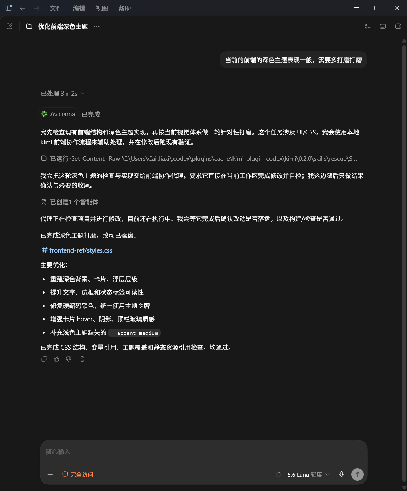

# kimi-plugin-codex

**Language / 语言:** [English](README.md) | [中文](README.zh-CN.md)

[](https://github.com/oppnc/kimi-plugin-codex/actions/workflows/ci.yml)
[](./LICENSE)
[](./CHANGELOG.zh-CN.md)

在 **OpenAI Codex**（本地 CLI / IDE）里，把 **[Kimi Code](https://github.com/MoonshotAI/kimi-code)** 当作 subagent 调用。

Kimi K3 前端、多模态很强，放在熟悉的 Kimi Code 环境里会更强。专业评测印证了这点：K3 训练时保留了 thinking history，若 harness 没有正确回传推理历史，表现会不稳定——Moonshot 官方建议用 Kimi Code 这样的 verified harness 来保证质量（[来源](https://www.nxcode.io/resources/news/kimi-k3-benchmarks-coding-agent-evaluation-guide-2026)）。Hugging Face 的量化记录也显示，K3 用 Kimi Code harness 评测，换成 Claude Code harness 只得到 73.7（[来源](https://huggingface.co/unsloth/Kimi-K3-GGUF)）。
更重要的是，更换 harness 会直接改变跑分**和**运行成本——换言之，让 K3 留在 Kimi Code 里既更准也更省。如果你已经习惯了 Codex，觉得切换工具很麻烦，本插件让你在 Codex 里直接把 Kimi Code 当 subagent 调用，K3 仍在它最熟悉的 Kimi Code 环境里干活。

吐槽一下，GPT 做的前端真的拉完了，虽然 codex 确实好用。

本插件会自动触发 Kimi——当任务涉及 UI/交互等前端场景时，主 agent 必须交给 Kimi 完成。
你也可以显式要求，例如「这个页面交给 Kimi 来处理」。
自动触发的规则住在插件里（`skills/rescue/SKILL.md` 的 description），装上就有默认的前端/UI 强制交接。想加强或放宽触发范围，可以在 Codex 全局指令里叠加，也可以在项目里修改 `AGENTS.md` 对单个仓库做专门调整。

本插件是 **薄 ACP 桥**，触发方式与 [cc-plugin-codex](https://github.com/sendbird/cc-plugin-codex) 一致：**Skills + companion**。**没有 MCP 工具。** 不支持 Codex Cloud。

| | |
| --- | --- |
| **版本** | **0.2.1** |
| **宿主** | 本地 OpenAI Codex |
| **Node** | ≥ 18.18 |
| **依赖** | Kimi Code CLI + `kimi login` |
| **触发** | **仅 Skills**（`$kimi:rescue` 等） |

Claude Code / Grok 请用 **[kimi-plugin-cc](https://github.com/oppnc/kimi-plugin-cc)**。

## 主路径

```text
主 agent 发现前端/UI 工作（或用户执行 $kimi:rescue）
  → 加载 skill，路由（bg/wait、resume；保守 shaping）
  → Codex 内置 default subagent（纯管道）
  → node <plugin-root>/scripts/kimi-companion.mjs task ...
  → 本机 Kimi Code（ACP）
```

| | |
| --- | --- |
| **主入口** | **`$kimi:rescue`**（前端/UI 匹配时可隐式加载） |
| **生命周期 / 运维** | `$kimi:setup`、`$kimi:status`、`$kimi:result`、`$kimi:cancel`、`$kimi:plan`、`$kimi:goal`、`$kimi:task`、`$kimi:sessions`（仅显式；UI 走 rescue） |
| **规则** | 主 agent 负责委托；Kimi 干活；结果 **原文返回** |
| **后台** | 父线程不等；用 **`$kimi:status` / `$kimi:result`** |

示例：

```text
$kimi:rescue 用现有 design tokens 把 settings 页做成响应式
$kimi:rescue --background 按截图修布局 --image C:/path/shot.png
$kimi:status
$kimi:result
```

详见 [AGENTS.md](AGENTS.md)。

> **实测**：在 Codex 里让 Kimi 打磨前端深色主题，Kimi 独立完成全部 CSS 变量重建与可读性修复，3 分 2 秒落盘。
>
> 

## 安装

需要：**Node.js ≥ 18.18**、本机 **[Kimi Code](https://github.com/MoonshotAI/kimi-code)** 并完成 `kimi login`、本机 **Codex**（不支持 Cloud）。

### 丢给 AI 安装

把下面整段复制给 Codex / Claude / Grok 等，让它代你装：

```text
请从 https://github.com/oppnc/kimi-plugin-codex 安装 Kimi Codex 插件

1. 前置：Node.js ≥ 18.18，已安装 Kimi Code CLI 并完成 kimi login。
2. 执行：
   codex plugin marketplace add oppnc/kimi-plugin-codex
   codex plugin add kimi@kimi-plugin-codex
3. 在 Codex 里跑 $kimi:setup，按输出修问题。
4. 用 $kimi:rescue 实现一个极小的响应式 settings 区块（用现有 design tokens）做冒烟。

仅本地 Codex（不支持 Codex Cloud）。Windows：若 PATH 找不到 kimi，设置
KIMI_CLI_PATH 指向 kimi.exe 全路径（常见 %USERPROFILE%\.kimi-code\bin\kimi.exe）。
```

### 自己装

```bash
codex plugin marketplace add oppnc/kimi-plugin-codex
codex plugin add kimi@kimi-plugin-codex
```

启用 **kimi**，必要时重启。首次：**`$kimi:setup`**。

改版本 / skills 后：

```bash
codex plugin marketplace upgrade kimi-plugin-codex
codex plugin remove kimi@kimi-plugin-codex
codex plugin add kimi@kimi-plugin-codex
```

本地 checkout（给插件作者）：

```bash
codex plugin marketplace add /absolute/path/to/kimi-plugin-codex
codex plugin add kimi@kimi-plugin-codex
```

若以前加过全局 MCP（0.3 之前）：

```bash
codex mcp remove kimi
```

## 首次验证

```text
$kimi:setup
$kimi:rescue 实现一个小的响应式 settings 区块（用现有 design tokens）
```

CLI 探针（不依赖宿主插件）：

```bash
node plugins/kimi/scripts/kimi-companion.mjs task --mode yolo -- "Reply with exactly: kimi-bridge-ok"
```

## 命令

| 命令 | 作用 |
| --- | --- |
| `$kimi:setup` | 检查 Kimi CLI / 登录 / ACP |
| `$kimi:rescue` | 交给 Kimi（内置 subagent + companion） |
| `$kimi:status` | 查看 job |
| `$kimi:result` | 打开已完成 job 输出 |
| `$kimi:cancel` | 取消运行中 job |
| `$kimi:plan` | 仅规划模式 companion（显式；非正常前端） |
| `$kimi:goal` | Goal 成帧（显式；大任务/UI → rescue） |
| `$kimi:task` | 轻量非 UI 一次调用（显式；前端 → rescue） |
| `$kimi:sessions` | 列出 ACP sessions（显式） |

## 超时与重试

- `--timeout <ms>` 是 **软** ACP 截止时间——超时时 companion 发送 `session/cancel`
  并保留会话，可用 `--resume` / `--session <id>` 继续同一线程。
- `--empty-retries <n>` 设置 Mode A 空 turn 新会话重试预算
  （默认 **5**，`KIMI_EMPTY_RETRIES` 环境变量，`0` 禁用）。
- `status --wait` / `result --wait` 在等待预算耗尽而 job 仍在运行时退出码为**非零**——等待超时 ≠ 交接完成。

## 排查

| 症状 | 处理 |
| --- | --- |
| `BINARY_NOT_FOUND` | 装 Kimi Code；`kimi login`；`KIMI_CLI_PATH` |
| `ACP_FAILED` / `LOGIN_REQUIRED` | `kimi login`；`$kimi:setup` |
| Skills 找不到 | 重装插件并重启 Codex |
| 仍看到旧的 `kimi_*` MCP 工具 | `codex mcp remove kimi`（0.3.0 已移除 MCP） |
| 长任务还在跑 | `$kimi:status` / `$kimi:result` |
| Codex Cloud | 不支持 |

## 兼容性

| 组件 | 要求 |
| --- | --- |
| 本插件 | 0.2.1 |
| Node | ≥ 18.18 |
| Kimi Code | ≥ 0.30.0（可用的 `kimi acp`） |
| Codex | 本地；plugin skills + 内置 subagent |

## 相关

| 包 | 宿主 |
| --- | --- |
| [kimi-plugin-cc](https://github.com/oppnc/kimi-plugin-cc) | Claude Code / Grok |
| **kimi-plugin-codex**（本仓库） | OpenAI Codex |
| [cc-plugin-codex](https://github.com/sendbird/cc-plugin-codex) | 宿主形态参考 |

维护者文档：[AGENTS.md](AGENTS.md) · 变更日志：[CHANGELOG.zh-CN.md](CHANGELOG.zh-CN.md)

## 许可证

MIT — 见 [LICENSE](./LICENSE)。
